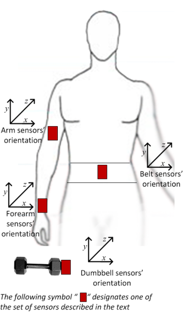

  
  
##1)Synopsis##
In this project we are going to build a model to evaluate and identify common mistakes in weight lifting technique, based on a set of movement sensors measurements distributed on the subject.  

  

##2)Exploratory Data Analysis##
First i'll load the datasets into memory. I'm not showing the code to download the files as it is not the scope of the project.


```r
full_training <- read.csv("pml-training.csv")
full_testing <- read.csv("pml-testing.csv")
```

Inspecting the dataset we can see that there are 160 variables, however we are not going to use all of them to generated our model.  
Also we can see that some variables correspond to sensor raw data but others are processed variables, so i group variables according the processing level as this:

- Raw Data: Accelerometer, Gyro and Magnetometers output data
- Level 1 Data: Variables processed realtime from raw data as Roll, Pitch and Yaw.
- Level 2 Data: Include statisticals computed over a time window over raw data. Skewness, Kurtosis, Variance, etc.
- Identifiers: Factors variables as ID, Subject, Time Window etc.

For this project i decided to work only with Raw Data and Level 1 data variables. As they represent the core information.  
Now let's generated new data set with this information only.


```r
library(dplyr)
# Select Raw data variables and dependent variable
raw_train_set <- select(full_training, starts_with("gyro"),starts_with("accel"),starts_with("magnet"),classe)

# Select Level 1 data variables and dependent variable
l1_train_set <- select(full_training, starts_with("roll"),starts_with("pitch"),starts_with("yaw"),classe)

# Check for NAs
sum(is.na(raw_train_set))
```

```
## [1] 0
```

```r
sum(is.na(l1_train_set))
```

```
## [1] 0
```

```r
# Repeat selection for test set
raw_test_set <- select(full_testing, starts_with("gyro"),starts_with("accel"),starts_with("magnet"))
l1_test_set <- select(full_testing, starts_with("roll"),starts_with("pitch"),starts_with("yaw"))

sum(is.na(raw_test_set))
```

```
## [1] 0
```

```r
sum(is.na(l1_train_set))
```

```
## [1] 0
```

Now we generate 2 new training sets with reduced variables and no NAs.

##3)Model Generation 1: Random Forrest with Raw Data##
I'll start using only Raw Data, the method selected for the model generation is Random Forrest as it is one of the most accurate ones.  
Let's start splitting the training set into 2 parts for cross validation before so we can check it before used in the training set.

```r
library(caret)
library(randomForest)

set.seed(1)

#Create Data Partition from raw training set
inTrain <- createDataPartition(y=raw_train_set$classe, p=0.6, list=FALSE)
training <- raw_train_set[inTrain,]
testing <- raw_train_set[-inTrain,]

#Generate a model from training data and validate it with the partition made
raw_mod <- randomForest(classe ~ ., data=training)
raw_pred <- predict(raw_mod, testing, type = "class")
confusionMatrix(raw_pred, testing$classe)
```

```
## Confusion Matrix and Statistics
## 
##           Reference
## Prediction    A    B    C    D    E
##          A 2224   21    2    5    0
##          B    4 1481   13    0    0
##          C    0   12 1353   42    0
##          D    4    1    0 1239    7
##          E    0    3    0    0 1435
## 
## Overall Statistics
##                                          
##                Accuracy : 0.9855         
##                  95% CI : (0.9826, 0.988)
##     No Information Rate : 0.2845         
##     P-Value [Acc > NIR] : < 2.2e-16      
##                                          
##                   Kappa : 0.9816         
##  Mcnemar's Test P-Value : NA             
## 
## Statistics by Class:
## 
##                      Class: A Class: B Class: C Class: D Class: E
## Sensitivity            0.9964   0.9756   0.9890   0.9635   0.9951
## Specificity            0.9950   0.9973   0.9917   0.9982   0.9995
## Pos Pred Value         0.9876   0.9887   0.9616   0.9904   0.9979
## Neg Pred Value         0.9986   0.9942   0.9977   0.9929   0.9989
## Prevalence             0.2845   0.1935   0.1744   0.1639   0.1838
## Detection Rate         0.2835   0.1888   0.1724   0.1579   0.1829
## Detection Prevalence   0.2870   0.1909   0.1793   0.1594   0.1833
## Balanced Accuracy      0.9957   0.9865   0.9903   0.9808   0.9973
```
In this case the accuracy of the model on the training set is 0.9855, so our estimated out of sample error is 0.0145

##4)Model Generation 2: Random Forrest with Level 1 Data##
Now i will repeat the model generation but this time using the level 1 variables.


```r
set.seed(1)

#Create Data Partition from raw training set
inTrain <- createDataPartition(y=l1_train_set$classe, p=0.6, list=FALSE)
training <- l1_train_set[inTrain,]
testing <- l1_train_set[-inTrain,]

#Generate a model from training data and validate it with the partition made
l1_mod <- randomForest(classe ~ ., data=training)
l1_pred <- predict(l1_mod, testing, type = "class")
confusionMatrix(l1_pred, testing$classe)
```

```
## Confusion Matrix and Statistics
## 
##           Reference
## Prediction    A    B    C    D    E
##          A 2215   12    0    0    0
##          B    9 1472   13    1    4
##          C    3   31 1338   13    5
##          D    1    2   16 1271    8
##          E    4    1    1    1 1425
## 
## Overall Statistics
##                                          
##                Accuracy : 0.9841         
##                  95% CI : (0.981, 0.9867)
##     No Information Rate : 0.2845         
##     P-Value [Acc > NIR] : <2e-16         
##                                          
##                   Kappa : 0.9799         
##  Mcnemar's Test P-Value : 0.0033         
## 
## Statistics by Class:
## 
##                      Class: A Class: B Class: C Class: D Class: E
## Sensitivity            0.9924   0.9697   0.9781   0.9883   0.9882
## Specificity            0.9979   0.9957   0.9920   0.9959   0.9989
## Pos Pred Value         0.9946   0.9820   0.9626   0.9792   0.9951
## Neg Pred Value         0.9970   0.9928   0.9954   0.9977   0.9973
## Prevalence             0.2845   0.1935   0.1744   0.1639   0.1838
## Detection Rate         0.2823   0.1876   0.1705   0.1620   0.1816
## Detection Prevalence   0.2838   0.1911   0.1772   0.1654   0.1825
## Balanced Accuracy      0.9951   0.9827   0.9850   0.9921   0.9936
```
In this case the accuracy of the model on the training set is 0.9841, so our estimated out of sample error is 0.0159. Note that we have the accurary is almost the same however we are using only 12 independent variables agains 36 in the raw set.

##5)Test Set Predictions##
Let's generated predictions over the testing dataset with the models we have created.

```r
raw_pred_testing <- predict(raw_mod, raw_test_set, type = "class")
raw_pred_testing
```

```
##  1  2  3  4  5  6  7  8  9 10 11 12 13 14 15 16 17 18 19 20 
##  B  A  B  A  A  E  D  B  A  A  B  C  B  A  E  E  A  B  B  B 
## Levels: A B C D E
```

```r
l1_pred_testing <- predict(l1_mod, l1_test_set, type = "class")
l1_pred_testing
```

```
##  1  2  3  4  5  6  7  8  9 10 11 12 13 14 15 16 17 18 19 20 
##  B  A  B  A  A  E  D  B  A  A  B  C  B  A  E  E  A  B  B  B 
## Levels: A B C D E
```

We can see that both models predict the same outcome so we i'll be using this output for the processing part of the project.
